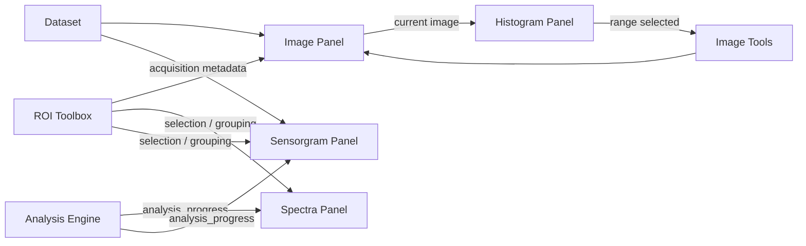

# LSPRi Evaluation rewrite: architecture sketch (2026-09-20)

First concrete architecture proposal for the LSPRi Evaluation rewrite,
synthesizing the entanglement diagnosis, the feature inventory, and the
maintainer's stage-based workflow vision (see `lspri_rewrite_initiative`,
`lspri_entanglement_diagnosis_2026_09`, and `lspri_rewrite_architecture_vision`
in the assistant's memory system, and `rewrite_feature_inventory_2026-09.md`
in this folder). This is a **sketch to react to, not a spec to build from
yet** - several points below are the assistant's own judgment call where the
brainstorming hadn't settled on an answer; those are marked explicitly.

---

## 1. Design goals this has to satisfy

From the discussion that led here:

- No god object: no module reads or writes another module's state directly.
- A real event mechanism must exist (today there is none - zero custom
  `pyqtSignal` usage for cross-panel communication anywhere in the app).
- Cosmetic changes (color, label, grouping) and computational changes
  (mask, chromatic model, ROI geometry, reduction method) must be
  distinguishable *mechanically*, not by convention/comment.
- Panels should not block each other and should own their own redraw
  pacing.
- Diagnosability (timing, event tracing) should come free from the
  architecture, not be bolted on per-feature after the fact.
- A handful of hard invariants from the current app must survive
  regardless of implementation (see §4).
- Stage-based workflow: Dataset -> Image Tools -> ROI Selection ->
  Analysis, with Spectra/Sensorgram as pure downstream consumers.

---

## 2. Module map

```mermaid
flowchart LR
    subgraph Pipeline["Computational pipeline (stage order)"]
        DS[Dataset]
        IT[Image Tools\n(geometry / mask / chromatic / background)]
        ROI[ROI Toolbox]
        AN[Analysis Engine\n+ versioned store]
        DS --> IT --> ROI --> AN
    end
    SEL[Selection / Navigation\nshared, narrow]
```



Each box in both diagrams is a module that **owns its own state exclusively**
and exposes only:
- a small **query interface** (plain method calls, read-only from the
  caller's perspective)
- a small set of **typed signals** it emits
- a small set of **request methods** other modules/panels may call to ask
  for a change (the module still decides how/whether to apply it)

No module reaches into another module's internals, ever - including
`main_window.py`'s current role. There should be no single class that
knows about every other module; a thin **shell** (see §7) wires modules
together at startup by connecting signals, and nothing more.

---

## 3. Communication mechanism

**Typed per-module Qt signals for real domain events**, not a single
generic "event bus with string names" - this is more idiomatic PyQt6,
gives you IDE/type-checker support, and makes "who can emit this" obvious
from the class that owns it:

```python
class RoiToolbox(QObject):
    geometry_changed = pyqtSignal(list)      # list[int] of affected roi_ids - COMPUTATIONAL
    cosmetic_changed = pyqtSignal(list)       # list[int] of affected roi_ids - COSMETIC
    selection_changed = pyqtSignal(set)       # set[int] currently selected
```

### Cosmetic vs. computational is a type distinction, not a naming convention

Rather than trusting every future contributor to remember "recolor is
cosmetic, resize is computational," wrap the two kinds of change in
distinct payload types:

```python
@dataclass(frozen=True)
class CosmeticChange:
    roi_ids: tuple[int, ...]
    reason: str  # "recolor" | "relabel" | "regroup" - for logging only

@dataclass(frozen=True)
class ComputationalChange:
    roi_ids: tuple[int, ...]
    reason: str  # "moved" | "resized" | "geometry_type_changed"
```

A subscriber that only cares about redraws connects to one signal; a
subscriber that must decide whether to invalidate analysis data connects to
the other. There is no way to "forget" the distinction at a call site,
because the two are different Python types, not the same signal with a
hoped-for convention in a string field.

### Built-in diagnosability, for free

Every module's public mutating methods go through one small decorator/
context-manager helper:

```python
@instrumented("RoiToolbox.move_roi")
def move_roi(self, roi_id: int, x: float, y: float) -> None:
    ...
```

`instrumented` times the call, logs one structured line
(`module.method | duration_ms | roi_ids=... `) at DEBUG (always captured to
the session log file, exactly like today's convention), and can optionally
publish a lightweight `Diagnostics.event_recorded(module, method,
duration_ms, timestamp)` signal that a future built-in performance panel
subscribes to - directly delivering the "monitor performance and usability
more easily" goal from the very start of this rewrite discussion, instead
of scattering `time.perf_counter()` calls only after a slowdown is
reported.

---

## 4. Threading model (non-negotiable)

- **Never let a `QThreadPool` worker touch (even indirectly, via a blocking
  wait) an OME-Zarr read.** This is not a style choice - it's tied to a
  real, root-caused native heap-corruption crash. The Analysis Engine's
  background dispatch uses plain `threading.Thread` (or a small pool built
  on it), matching the current app's `FunctionWorker`.
- One narrow, deliberate exception: HDF5-only work (writing to the
  versioned store) may use a single-thread `QThreadPool` if write-ordering
  is needed - it never touches zarr.
- Results cross back to the GUI thread via Qt signals only, same as today.
- **Never run a curve fit or other nonlinear computation on the GUI
  thread**, including for "live preview" - this was a real, currently-open
  performance bug in the existing app (a fit running every 80ms on the GUI
  thread, contending with a background sweep). Any panel-owned "live"
  redraw reads already-computed values; it never computes.

---

## 5. The analysis store: one file, per-cell provenance

**Revised from this sketch's first draft.** The original proposal here was
one whole HDF5 file per global settings-hash ("PixelDataVersion"), with a
copy-forward step when only part of the settings changed. Good pushback
changed this: instead of hashing everything and invalidating at *file*
granularity, track provenance **per stored cell**, matching what a couple
of the current app's cache tiers already do correctly (`_sensorgram_metric_
cache` is already atomic per (ROI, cube) today - the actual gap in the
current app isn't the granularity, it's that one specific cache tier's
signature is *incomplete*, not that per-cell tracking itself is wrong).

**One ongoing HDF5 file per dataset**, not a folder of version-hashed
files. Each stored cell - one (ROI, cube) pair's reduced sample/reference
values plus derived formula/metric - carries its own compact **provenance
record**: the narrow, *complete* set of discretized inputs that actually
produced it (this ROI's own geometry, the mask state within this ROI's own
reach box only, the chromatic affine for this image key, the background
model, the reduction method) - never a global blob, just what that one
cell actually depends on.

**Simplified (2026-09-20): no materiality/pixel-selection comparison.**
An earlier pass considered comparing the actual set of pixels a geometric
input would select (so a sub-pixel nudge that doesn't change any pixel's
inclusion wouldn't trigger a recompute) - deliberately dropped in favor of
a simpler rule: **any change to a cell's inputs, however small, triggers
recompute for that cell.** Position/radius/model values are compared with
a small fixed rounding (just enough to absorb floating-point noise from
re-serializing the same number, e.g. 1e-9 - not a materiality judgment).
This trades a small amount of occasionally-unnecessary recompute for a
much simpler rule with nothing to get subtly wrong; the pixel-selection
optimization can be revisited later if unnecessary recomputes ever prove
costly in practice.

**Recompute decision, per cell**: compute the current fingerprint for a
cell fresh (cheap - no pixel access, just reading current settings/
geometry), compare it to the stored one. Match -> already correct, skip.
Mismatch or missing -> queue for (re)computation. There's no separate
"which rows carry over" logic to write, because unaffected cells were
never touched in the first place - there's only ever one file.

**Extends naturally to per-cube granularity later**, which you flagged as
a real future need (a mask that only changes on certain frames). Once a
cube-specific input exists, it's just one more field in that specific
(ROI, cube) cell's fingerprint - no architecture change needed when that
feature actually gets built. Today's design already keys fingerprints by
(ROI, cube); it's just that most inputs happen to be cube-invariant today.

**Range changes never invalidate anything.** Extending the analysis
scope's cube/wavelength range only adds new empty cells to fill - it can
never make an *existing* cell's fingerprint mismatch, since the range
itself isn't one of that cell's inputs. This matches your own observation
that changing the calculation range is a "global tool that definitely
won't touch anything."

**File shape superseded (2026-09-22)** - the sketch below (one
`provenance_table.json`, dedup by hashed fingerprint blob) was the original
placeholder; design discussion replaced it with a file-per-provenance-input
scheme instead (masks/backgrounds as real image files, sequential per-frame
version numbers instead of hashing, settings-snapshot JSONs that reference
them). Full detail: `docs/analysis_provenance_store_design_2026-09.md`.
This section's *rules* above (one HDF5 file, per-cell fingerprints, the
locality rules) are unaffected - only the on-disk shape of a cell's
provenance record changed.

```
analysis/
  data.h5                 # every (ROI, cube) reduced value + its provenance record
  provenance_table.json   # superseded - see docs/analysis_provenance_store_design_2026-09.md
```

### Restore semantics (same spirit, simpler in practice)
- HDF5 present -> every cell's own provenance is already known; nothing to
  guess.
- HDF5 missing/deleted -> nothing computed; the next analysis run starts
  from empty cells and the same recompute-decision logic applies (every
  cell "mismatches" because nothing exists yet).
- The proposed in-app "what's actually in the backup file" reader has an
  easy job here: read `provenance_table.json` and report exactly which
  ROIs/cubes/quantities exist and under what settings, cell by cell.

---

## 6. Recompute-dependency reasoning

A pure function, no Qt/GUI dependency (same spirit as `analysis_tasks.py`
today, which has zero `window.*` references) - callable from the Analysis
Engine and independently testable:

```python
def plan_recompute(
    stored: ProvenanceStore,        # read-only view of what's on disk now
    current_inputs: CurrentInputs,  # live settings/geometry, evaluated fresh
    scope: AnalysisScope,           # ALL_ROIS or SELECTED_ROIS - user's choice
) -> RecomputePlan:
    """For every (roi, cube) pair in scope: compute the current discretized
    fingerprint, compare it against `stored`'s fingerprint for that cell
    (if any), and mark it recompute/skip."""
```

Locality rules this needs to encode, gathered from the brainstorming and
the feature inventory:

- **Global, definitely-no-effect changes** - grouping, color, name, and the
  analysis range/scope itself - never touch any cell's fingerprint at all.
  These are exactly the `CosmeticChange` category from §3; the planner
  never even runs for them.
- **A single ROI's own geometry change** affects only that ROI's cells -
  **with one real exception already found in the current app**: a ROI's
  reference-ring exclusion carves out a neighboring ROI's sample circle,
  so moving ROI X can also change ROI Y's fingerprint if Y is close enough.
  The planner's "which cells does this input touch" check needs the same
  spatial-adjacency logic the current pixel-exclusion mask already uses -
  not a naive "only the touched ROI" assumption.
- **A mask edit** touches only cells whose ROI reach-box overlaps the
  *changed region* - naturally local, since each cell's fingerprint only
  ever includes the mask state within its own reach box to begin with.
- **A chromatic-model refit** touches every ROI's cells on every
  non-reference wavelength - global impact, by the simplified any-change
  rule above (a fractional-pixel-weighting mode, §6a, would make very
  small refits genuinely harmless rather than just "not recomputed," which
  is a different and better fix for the underlying concern if it turns out
  to matter).
- **A background-model change** touches every cell - global impact.
- **Reduction-method change** touches every cell's fingerprint -
  unavoidably global, since it changes how the same pixels become a number
  everywhere.
- **Formula, Fit method, Metric choice** - never touch the stored cells at
  all; computed live from whatever's already in the store.

---

## 6a. Fractional pixel weighting (new, optional, toggled per analysis)

Today's ROI pixel selection is binary: a pixel counts if its center falls
inside the shape, full stop. That's fine at the resolutions and ROI sizes
this app normally works with, but it does mean boundary pixels contribute
all-or-nothing, adding a small amount of quantization noise right at the
edge of every ROI. The maintainer asked for a sketch of **partial-pixel
weighting**: for a pixel that a circle/polygon edge cuts through, weight
its contribution by the *fraction* of its area that's actually inside the
shape. This is a well-established technique, not something novel to
invent - it's exactly what astronomical "aperture photometry" tools do
(e.g. `photutils.aperture`'s `exact`/`subpixel` methods).

Two standard ways to compute the fractional coverage, in order of
recommendation:

1. **Supersample-and-downsample (recommended default).** Rasterize the
   ROI shape at N× the native resolution (e.g. 8x or 16x), then
   average-pool back down to native pixel size - each native pixel's
   value in the pooled result *is* its fractional coverage. This works
   identically for every geometry type - circle, rectangle, polygon, and
   the existing arbitrary-mask escape hatch - with **one shared
   implementation**, no shape-specific math. That matters given
   `roi_system_roadmap.md`'s own stated preference for a geometry-type
   dispatcher over one bespoke code path per shape: this technique gives
   the "exact-ish" behavior for free across every current and future
   shape, rather than needing new geometric formulas every time a new ROI
   shape is added. It reuses the existing rasterization code
   (`roi_rasterize.py`) at a higher internal resolution - no new
   dependency needed.
2. **Exact analytical intersection (higher precision, shape-specific).**
   For circles, closed-form circular-segment geometry gives the exact
   overlap area with each boundary pixel (`photutils`' `'exact'` method
   uses this). For convex polygons, OpenCV's `cv2.intersectConvexConvex`
   returns the exact intersection polygon and area between two convex
   shapes directly - this is likely the "OpenCV model" you were thinking
   of, and it's a real, fast, C-optimized function, not something to
   implement from scratch. More precise than supersampling, but needs a
   different formula per shape family, which cuts against the
   one-dispatcher-fits-all direction the ROI roadmap already committed to.

**Recommendation**: implement (1) as the general engine so it works for
every geometry type uniformly from day one; keep (2) in mind only if a
specific shape's precision ever proves insufficient - consistent with the
roadmap's own "don't build generic machinery ahead of a proven need"
stance.

**Real implementation cost, to be upfront about it**: this doesn't just
change which pixels get counted - it changes the reduction math itself.
`mean`/`plane_fit` generalize to a weighted mean/weighted plane fit
trivially, but `median` and `trimmed_mean` need genuine weighted-median-
style implementations, which are a different (and slightly more involved)
algorithm than their unweighted counterparts, not just "pass weights
through." This is real work, not a free toggle - flagging it now so it's
budgeted rather than discovered mid-implementation.

**Where it fits the architecture already sketched**: this becomes one more
computational setting living in the ROI Toolbox / reduction step, included
in each affected cell's provenance fingerprint (§5) like any other
computational input - no new architectural concept needed, it slots
directly into what's already there.

---

## 7. Per-module sketch

### Dataset
Owns: `ImageDataset`, acquisition metadata, format load/convert.
Emits: `dataset_loaded`, `dataset_cleared`.
Exposes: `current_image(cube_index, wavelength) -> ImageRecord`,
`wavelengths()`, `spectral_cubes()`, `acquisition_metadata()`.
Nothing here changes from the current app's `io/dataset.py` /
`storage/workspace.py` layer - it's already clean (see feature inventory).

### Image Tools
Proposal (an assistant judgment call, confirm or redirect): one **stage
owner** coordinating four narrow sub-modules, matching the maintainer's own
"crop/rotate/mask/CC/background all belong to the Image Tools stage,
each independent and well-documented" framing:

- **Geometry** (crop/rotate/flip) - owns `PreprocessingSettings`'
  spatial fields. Emits `geometry_changed` (`ComputationalChange`).
- **Mask** - owns algorithmic mask settings + the raster file-mask.
  Emits `mask_changed` (`ComputationalChange`).
- **Chromatic** - owns landmarks + fitted models. Exposes
  `affine_for(image_key) -> Affine`, `warp_mask(mask, image_key) -> mask`
  as its **only** public surface - ROI/Mask code never reaches into its
  internals, matching the interface boundary the feature inventory
  proposed for this specifically-inherent coupling. Emits
  `chromatic_model_changed` (`ComputationalChange`).
  **Confirmed (2026-09-20): the fitted model is a math model, and it needs
  to be fully reproducible from an export.** In practice this means the
  resulting coefficients (not just the settings/landmarks that produced
  them) get captured in a cell's provenance record (§5) whenever that model
  was used to compute a value - so an exported HDF5 + `provenance_table.json`
  pair is self-contained proof of exactly which correction produced each
  number, with no separate settings file to keep in sync. The *live,
  currently-being-calibrated* model (landmarks not yet finalized) stays
  in this module only; it's captured into provenance the moment it's
  actually used to compute something.
- **Background** - owns the fitted background model (see the estimate/
  apply split discussed earlier: estimation touches pixels, application is
  a cheap formula/lookup). Emits `background_model_changed`
  (`ComputationalChange`).

All four are static per spectral-cube today, matching the explicit
"deferred, not now" decision on time-varying mask/CC.

### ROI Toolbox
Owns: `AreaRoi` list, `AreaRoiGroup` list, `RoiArrayGroup` recipes,
detection settings. Follows `roi_system_roadmap.md`'s already-considered
`Pair` vocabulary (sample/reference linkage) and geometry-type dispatcher -
adopted rather than re-derived, per the roadmap's own explicit reasoning
for rejecting a fully generic model.
Emits: `geometry_changed`/`cosmetic_changed`/`selection_changed` as typed
signals (§3).
Exposes: `rois()`, `roi_by_id()`, `groups()`, `display_position(roi_id,
image_key)` (folds in Chromatic's `affine_for` internally - callers never
compose the chromatic transform themselves), plus a full **command API**:
`move_roi`, `resize_roi`, `delete_roi`, `detect_rois`, `create_group`,
`rename_group`, `recolor_group`, `reorder_group`, `add_to_group`,
`remove_from_group`.

**Revised (2026-09-20): one backend, several front doors - not a thin
view.** The command API above is the single owner of every invariant (ROI
IDs, "at most one group per ROI," ordering), but it's meant to be called
from multiple UI surfaces, each exposing whichever subset suits its form
factor - that's *intended* duplication of affordances calling one shared
backend, which is different from today's problem (duplicated *logic* in
`group_table_controller.py` and `roi_geometry_mixin.py` independently
reimplementing group mutation). Concretely:

- The Workflow panel's ROI section is organized as sub-tabs - **Finding
  ROIs** (detection settings/run), **Editing ROIs** (manual add/move/
  remove/geometry), **ROI Groups** (create/rename/recolor/reorder) -
  rather than one flat section.
- The **Image panel** calls the same command API for click-to-select,
  drag-to-move, and a context menu (group/ungroup/select-group-members) -
  operations that are naturally spatial and awkward in a table.
- The **ROI/Group table panel** calls the same command API for anything
  naturally tabular - rename, recolor, reorder (the "#" column and Move
  Up/Down from this session's own group-ordering work), bulk multi-select
  operations - so the user doesn't have to leave the panel they're already
  looking at (Image or Sensorgram) and go back to the Workflow tab just to
  rename a group.

None of these three surfaces hold their own copy of ROI/group state or
logic - they're all thin *renderers* of `rois()`/`groups()` that turn user
gestures into command-API calls, but "thin" doesn't mean "display only" -
each legitimately owns real editing UI, just never its own data model.

### Analysis Engine
Owns: the store (§5), the recompute planner (§6), background workers.
Emits: `analysis_progress` (batched/coalesced, not per-cube - see §8),
`store_updated`, `analysis_complete`.
Exposes: `get_metric(roi_id, cube_index) -> float | None`,
`get_spectrum(roi_id, cube_index) -> np.ndarray | None`,
`status_summary() -> AnalysisStatus` (for the proposed "what's actually in
the HDF5" indicator).

**Confirmed (2026-09-20): analysis is only ever run by explicit user
action, never automatically.** `run_analysis(scope: AllRois |
SelectedRois)` is the *only* entry point that triggers real computation -
default scope is all ROIs, with an explicit option to scope to the current
selection for a faster partial run. Selecting or deselecting ROIs, or
navigating between panels, never implicitly kicks off computation - it
only changes what `get_metric`/`get_spectrum` are asked to return, which
may legitimately come back `None` (not yet analyzed). Display panels show
that as "needs analysis," never by silently computing it themselves.

Subscribes to every `ComputationalChange` signal from Image Tools and ROI
Toolbox purely to know the current inputs are stale *for the next run the
user asks for* (e.g., to power the "what's missing" indicator) - it never
reacts to them by launching a background computation on its own.

### Selection / Navigation
The one genuinely cross-cutting piece of shared state (current spectral
cube/wavelength, current ROI selection) - explicitly **not** smeared across
a god object, but its own small, narrowly-scoped module with its own
change events, since several panels legitimately need to read it. This is
an intentional, acknowledged exception to "nothing is shared," not an
accidental one.

### Display panels (Image, Histogram, Spectra, Sensorgram)
All follow the same shape: **read from the modules above via their query
interfaces, own no computation, own their own redraw pacing/coalescing**
(§8), and turn user interaction into request calls on the owning module
rather than mutating anything themselves.

- **Image**: reads Dataset + Image Tools (to render the processed image) +
  ROI Toolbox (`display_position`, for overlays) + Selection. Forwards
  drag/click as `RoiToolbox.request_move(...)` etc. - never touches ROI
  state directly, resolving the current app's "lots of connection between
  Image panel and ROI section" complaint.
- **Histogram**: self-sufficient per the maintainer's own description -
  pulls "current displayed image" from Image (one narrow read), computes
  and plots its own histogram, emits its own range-selection events, which
  Mask (not Image) subscribes to.
- **Spectra**: reads Analysis Engine + ROI Toolbox (for coloring/
  selection) + Selection. Owns its own fit-curve display and range tools.
  Never computes a fit for "live preview" on the GUI thread (§4).
- **Sensorgram**: same shape as Spectra, plus reads Dataset's acquisition
  metadata narrowly for the proposed pump-plan-step overlay. Its own
  redraw coalescing (§8) replaces today's shared "Live" toggle entirely.

### Workflow shell
A thin navigation/status host - hosts the stage tabs, shows which stage is
active, hosts the status bar (state/performance only, no hover-hint text,
per the settled decision) - and otherwise owns no scientific state. This
replaces `MainWindow`'s role as a god object; it should be small enough
that removing it and rewiring the modules directly would be a mechanical
exercise, not a redesign.

---

## 8. Redraw pacing (every display panel, not just Sensorgram)

Each display panel owns a short coalescing timer (matching the already-
validated ~100ms window in the current app) between "an event arrived" and
"actually redraw." This is what turns a reactive/event-driven display into
one that doesn't reintroduce the current app's "redraw cost scaled with
already-drawn point count, made a run scale quadratically with cube count"
bug - reacting immediately to *every* event is not the same as reacting
*promptly*, and the difference is exactly this per-panel pacing.

---

## 9. Open questions

Resolved during review (2026-09-20): Image Tools' four-sub-module split (1)
is accepted; the ROI Toolbox is one backend with several front doors, not a
thin view (2, revised in §7); Chromatic's interface is confirmed sufficient,
with its output captured into cell provenance for export reproducibility
(3, revised in §7); the store's recompute rule was simplified to plain
any-change-triggers-recompute rather than a materiality/pixel-selection
comparison (formerly open question 4, now §5/§6 - deliberately simplified,
not resolved by adding rigor); Analysis is confirmed explicit-user-
triggered only, with an All/Selected scope choice, which also answers
whether Selection can trigger recompute - it never does (formerly open
question 5); Masking is confirmed as part of Image Tools, using Chromatic's
`warp_mask()` for its own raw-space-to-processed-space needs (formerly open
question 3 from the previous round).

Still open:

1. ~~`provenance_table.json`'s deduplication scheme~~ - resolved
   2026-09-22, see `docs/analysis_provenance_store_design_2026-09.md`
   (file-per-input, sequential per-frame versions, no hashing). A few
   pieces of that design are themselves still open - see that doc's own
   "Still open" section.
2. Fractional pixel weighting (§6a): the raster half is built
   (`roi/rasterize.py`'s `rasterize_fractional`, 2026-09-22 - supersample-
   and-downsample, one shared engine for every geometry type). The
   weighted-median/weighted-trimmed-mean math the reduction half needs
   (`analysis/reduction.py`) still isn't designed.

---

## 10. Proposed package layout

Maps §7's module boundaries onto an actual directory structure. The
pattern repeats at every level, not just at the top: **a QObject "module"
class owns state/signals/commands; pure computation lives in sibling
files with no Qt import at all** - the same "clean core, thin Qt shell"
split the feature inventory found already working well in today's
`processing/`/`io/`/`storage/` layer, applied consistently everywhere
instead of only in some areas.

```
lspr_imaging_app/
  app.py                    # entry point - wires modules together, nothing else
  diagnostics/
    instrumented.py         # @instrumented decorator + shared Diagnostics signal hub (§3)

  dataset/
    model.py                # ImageKey, ImageRecord, CompactImageTimings, ImageDataset - dataclasses
    io.py                    # ports current io/dataset.py as one file, largely as-is
                              # (corrected 2026-09-20: format-agnostic dispatch/caching/discovery
                              # code is mixed throughout the real file, not separable into a
                              # tiff-only/zarr-only split - see dataset/__init__.py's own note)
    module.py                # DatasetModule(QObject) - owns state, emits dataset_loaded/cleared

  image_tools/
    geometry.py               # GeometryModule(QObject) - crop/rotate/flip
    mask.py                   # MaskModule(QObject) - algorithmic + file mask; calls chromatic.warp_mask
    chromatic/
      model.py                 # ChromaticModel, LandmarkObservation - dataclasses
      fitting.py                # pure math - ports processing/chromatic.py's fitting/warping/tracking largely as-is
      module.py                 # ChromaticModule(QObject) - affine_for()/warp_mask() + landmark-editing commands
    background/
      estimate.py               # pure math - one-time, real-pixel-based estimation
      apply.py                   # pure math - fast formula/lookup application (the split discussed earlier)
      module.py                  # BackgroundModule(QObject)
    preprocess.py              # pure function composing all four - ports processing/preprocess.py mostly as-is

  roi/
    model.py                  # AreaRoi, AreaRoiGroup, RoiArrayGroup - the Pair vocabulary from roi_system_roadmap.md
    detection.py               # pure math - ports roi_detection.py / roi_array_geometry.py largely as-is
    rasterize.py                 # pure math - mask/pixel-weight rasterization, ports roi_rasterize.py,
                                  # extended with supersample-and-downsample per §6a (new work) - produces
                                  # a raster/weight mask from shape, never reads pixel values
    toolbox.py                  # RoiToolbox(QObject) - the command API + signals from §7

  analysis/
    reduction.py                # pure math - mean/median/trimmed_mean/plane_fit, ports roi_math.py, extended
                                 # with weighted variants per §6a (new work, not a port) - moved here from
                                 # roi/ 2026-09-21: turning masked pixels into a scalar is a calculation,
                                 # not something the ROI Toolbox does
    provenance.py              # ProvenanceRecord + fingerprint computation + dedup table - new, per §5
    planner.py                  # plan_recompute() - new, per §6
    tasks.py                     # pure per-cell compute - ports analysis_tasks.py largely as-is
    worker.py                     # threading.Thread dispatch - ports FunctionWorker, never QThreadPool near zarr (§4)
    engine.py                     # AnalysisEngine(QObject) - run_analysis()/get_metric()/status_summary()

  selection/
    module.py                  # SelectionModule(QObject) - current cube/wavelength/selected ROI ids (§7)

  panels/
    image/panel.py             # reads Dataset+ImageTools+RoiToolbox, forwards interaction as command calls
    histogram/panel.py          # self-sufficient - reads Image's current array, own range-selection events
    roi_table/panel.py           # calls RoiToolbox's command API - rename/recolor/reorder/group tools live here
    spectra/panel.py + plot.py
    sensorgram/panel.py + plot.py
    workflow/panel.py            # stage tabs + status bar - the thin shell replacing MainWindow's god-object role

  storage/
    session.py                 # settings JSON + ROI JSON read/write - ports storage/workspace.py mostly as-is
    measurement_export.py       # ports storage/measurement_export*.py, adapted for the §5 per-cell provenance design
```

**What ports largely as-is** (the clean numeric/IO core the feature
inventory already validated): `dataset/io.py` (done 2026-09-20 - see the
dataset/ note in §10's layout above), `image_tools/chromatic/
fitting.py`, `image_tools/preprocess.py`, `roi/detection.py`,
`analysis/tasks.py`, `storage/session.py`. **What's genuinely new work**:
every `module.py`/`toolbox.py`/`engine.py` (the signal/command wrapper
classes - today's app has none of these, since it has no event system at
all), `analysis/provenance.py` + `planner.py` (§5/§6, replacing today's
several independent, sometimes-incomplete cache signatures), and the
weighted-reduction/supersampling work in `analysis/reduction.py` and
`roi/rasterize.py` (§6a, a genuinely new feature, not a port of anything
existing).
